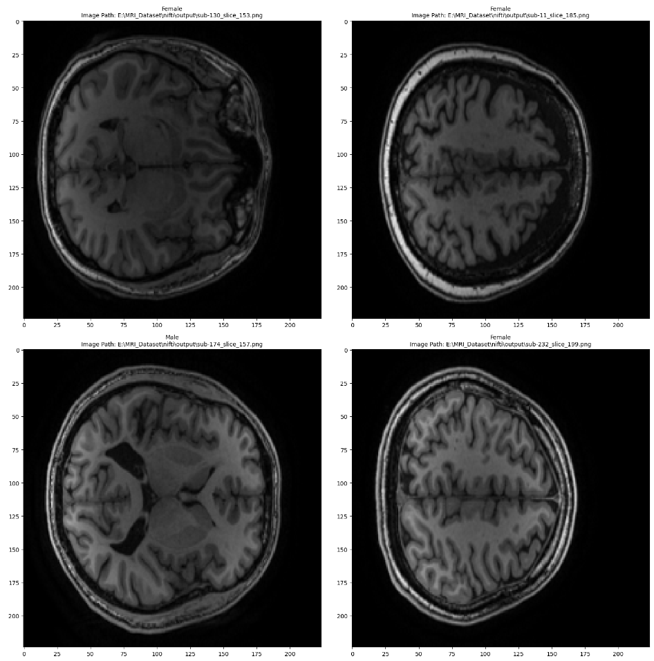
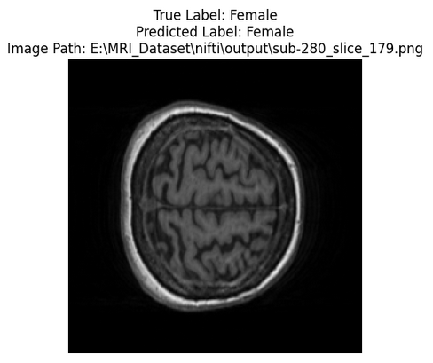

# MRI Gender Classification
 
This repository contains the script to create the [T1w MRI Brain Slices Dataset](https://huggingface.co/datasets/g4m3r/T1w_MRI_Brain_Slices) using the [Neurocognitive aging data release with behavioral, structural, and multi-echo functional MRI measures](https://openneuro.org/datasets/ds003592/versions/1.0.13) dataset, created by [Spreng et al.](https://doi.org/10.18112/openneuro.ds003592.v1.0.13).

The [T1w MRI Brain Slices Dataset](https://huggingface.co/datasets/g4m3r/T1w_MRI_Brain_Slices) contains images of brain MRI scans of 301 healthy adults (181 younger, 120 older adults) alongside information about their sex, age and education. It contains 30 images from the coronal axis of each person's scan.

# extract_images.py
Was used to create the [T1w MRI Brain Slices Dataset](https://huggingface.co/datasets/g4m3r/T1w_MRI_Brain_Slices) using the [Neurocognitive aging data release with behavioral, structural, and multi-echo functional MRI measures](https://openneuro.org/datasets/ds003592/versions/1.0.13) dataset.



# Gender_Classification.ipynb
Contains an example implementation using Pytorch and Timm with a pre-trained resnet50 model.
This simple model achieved an accuracy of over 99% on the test dataset after 10 epochs of training.

Results after 10 Epochs of training:
```
Accuracy: 0.9909
Precision: 0.9917
Recall: 0.9863
F1 Score: 0.9890
```



